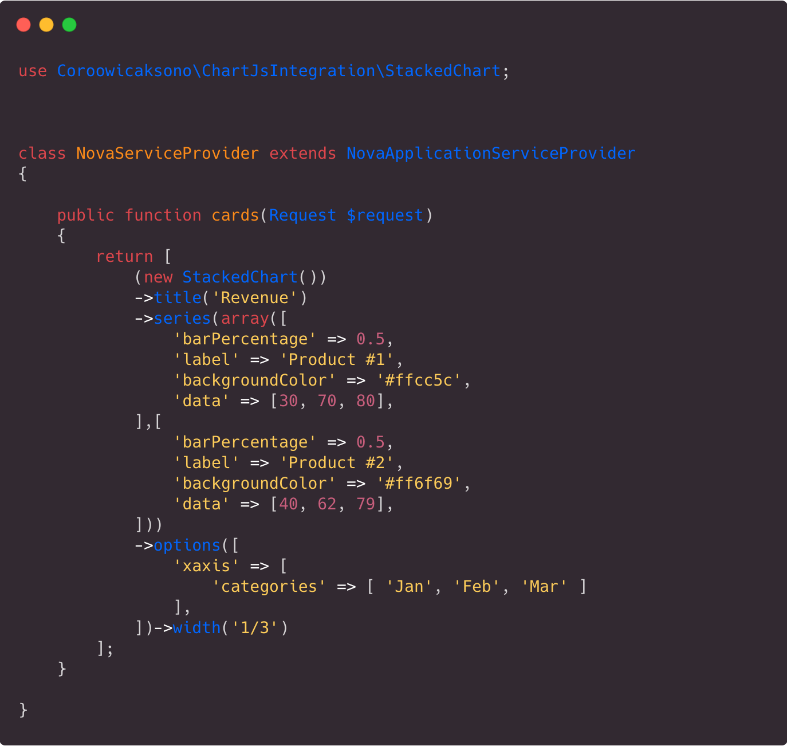
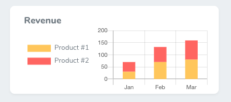
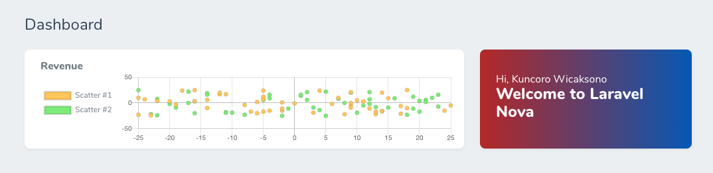
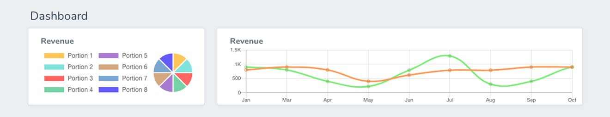
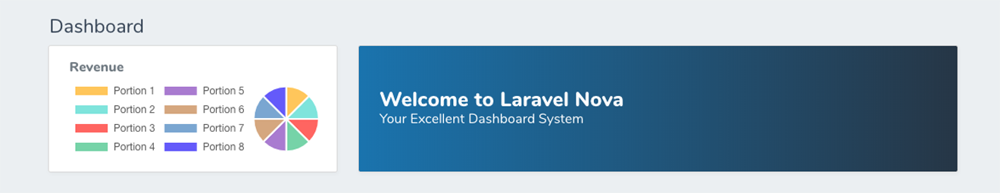
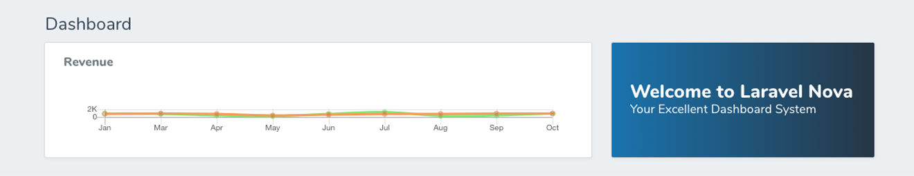
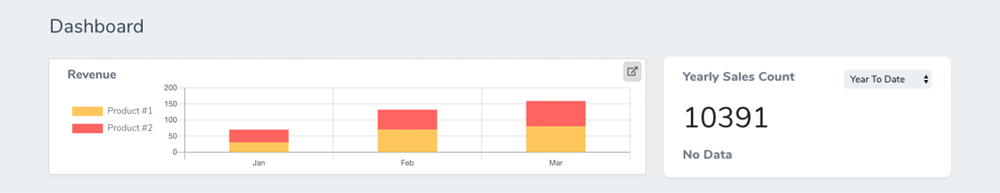
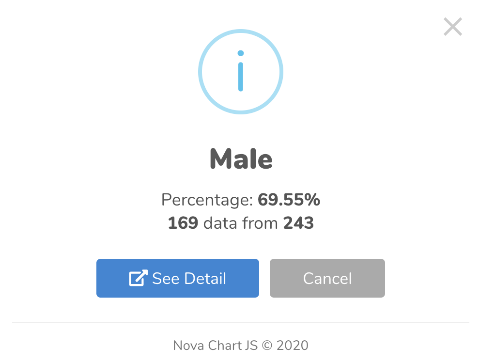

# Getting Started

## Requirements

This Nova Chart JS Integration requires `Nova 2.0 or higher`


## Installation

You can install the package via composer:

```bash
composer require coroowicaksono/chart-js-integration
```

<!-- panels:start -->

<!-- div:title-panel -->

## Basic Usage

Open your `App\Providers\NovaServiceProvider.php` as a default dashboard for Laravel Nova and edit `cards` function:

<!-- div:left-panel -->




Result :



<!-- div:right-panel -->

```php
use Coroowicaksono\ChartJsIntegration\StackedChart;
```

```php
(new StackedChart())
    ->title('Revenue')
    ->series(array([
        'barPercentage' => 0.5,
        'label' => 'Product #1',
        'backgroundColor' => '#ffcc5c',
        'data' => [30, 70, 80],
    ],[
        'barPercentage' => 0.5,
        'label' => 'Product #2',
        'backgroundColor' => '#ff6f69',
        'data' => [40, 62, 79],
    ]))
    ->options([
        'xaxis' => [
            'categories' => [ 'Jan', 'Feb', 'Mar' ]       
        ],
    ])
    ->width('1/3'),
```

<!-- panels:end -->

# Custom Chart

## Stacked Chart


Include this line to header in your NovaServiceProvider.php
```php
use Coroowicaksono\ChartJsIntegration\StackedChart;
```

Add this line as return for your `cards` function:

```php
(new StackedChart())
    ->title('Revenue')
    ->animations([
        'enabled' => true,
        'easing' => 'easeinout',
    ])
    ->series(array([
        'barPercentage' => 0.5,
        'label' => 'Average Sales',
        'backgroundColor' => '#999',
        'data' => [80, 90, 80, 40, 62, 79, 79, 90, 90, 90, 92, 91],
    ],[
        'barPercentage' => 0.5,
        'label' => 'Average Sales 2',
        'backgroundColor' => '#F87900',
        'data' => [40, 62, 79, 80, 90, 79, 90, 90, 90, 92, 91, 80],
    ]))
    ->options([
        'xaxis' => [
            'categories' => [ 'Jan', 'Mar', 'Apr', 'May', 'Jun', 'Jul', 'Aug', 'Sep', 'Oct' ]
        ],
    ])
    ->width('2/3'),
```

## Bar Chart


Include this line to header in your NovaServiceProvider.php
```php
use Coroowicaksono\ChartJsIntegration\BarChart;
```

Add this line as return for your `cards` function:
```php
(new BarChart())
    ->title('Revenue')
    ->animations([
        'enabled' => true,
        'easing' => 'easeinout',
    ])
    ->series(array([
        'barPercentage' => 0.5,
        'label' => 'Average Sales',
        'backgroundColor' => '#999',
        'data' => [80, 90, 80, 40, 62, 79, 79, 90, 90, 90, 92, 91],
    ],[
        'barPercentage' => 0.5,
        'label' => 'Average Sales 2',
        'backgroundColor' => '#F87900',
        'data' => [40, 62, 79, 80, 90, 79, 90, 90, 90, 92, 91, 80],
    ]))
    ->options([
        'xaxis' => [
            'categories' => [ 'Jan', 'Mar', 'Apr', 'May', 'Jun', 'Jul', 'Aug', 'Sep', 'Oct' ]
        ],
    ])
    ->width('2/3'),
```

## Line Chart


Include this line to header in your NovaServiceProvider.php
```php
use Coroowicaksono\ChartJsIntegration\LineChart;
```

Add this line as return for your `cards` function:
```php
(new LineChart())
    ->title('Revenue')
    ->animations([
        'enabled' => true,
        'easing' => 'easeinout',
    ])
    ->series(array([
        'barPercentage' => 0.5,
        'label' => 'Average Sales',
        'borderColor' => '#f7a35c',
        'data' => [80, 90, 80, 40, 62, 79, 79, 90, 90, 90, 92, 91],
    ],[
        'barPercentage' => 0.5,
        'label' => 'Average Sales #2',
        'borderColor' => '#90ed7d',
        'data' => [90, 80, 40, 22, 79, 129, 30, 40, 90, 92, 91, 80],
    ]))
    ->options([
        'xaxis' => [
            'categories' => [ 'Jan', 'Mar', 'Apr', 'May', 'Jun', 'Jul', 'Aug', 'Sep', 'Oct' ]
        ],
    ])
    ->width('2/3'),
```

## Area Chart


Include this line to header in your NovaServiceProvider.php
```php
use Coroowicaksono\ChartJsIntegration\AreaChart;
```

Add this line as return for your `cards` function:
```php
(new AreaChart())
    ->title('Revenue')
    ->animations([
        'enabled' => true,
        'easing' => 'easeinout',
    ])
    ->series(array([
        'barPercentage' => 0.5,
        'label' => 'Average Sales',
        'backgroundColor' => '#f7a35c',
        'data' => [80, 90, 80, 40, 62, 79, 79, 90, 90, 90, 92, 91],
    ],[
        'barPercentage' => 0.5,
        'label' => 'Average Sales #2',
        'backgroundColor' => '#90ed7d',
        'data' => [90, 80, 40, 22, 79, 129, 30, 40, 90, 92, 91, 80],
    ]))
    ->options([
        'xaxis' => [
            'categories' => [ 'Jan', 'Mar', 'Apr', 'May', 'Jun', 'Jul', 'Aug', 'Sep', 'Oct' ]
        ],
    ])
    ->width('2/3'),
```

## Doughnut Chart


Include this line to header in your NovaServiceProvider.php
```php
use Coroowicaksono\ChartJsIntegration\DoughnutChart;
```

Add this line as return for your `cards` function:
```php
(new DoughnutChart())
    ->title('Revenue')
    ->series(array([
        'data' => [10, 10, 10, 10, 10, 10, 10, 10],
        'backgroundColor' => ["#ffcc5c","#91e8e1","#ff6f69","#88d8b0","#b088d8","#d8b088", "#88b0d8", "#6f69ff"],
    ]))
    ->options([
        'xaxis' => [
            'categories' => ['Portion 1','Portion 2','Portion 3','Portion 4','Portion 5','Portion 6','Portion 7','Portion 8']
        ],
    ])->width('1/3'),
```

## Pie Chart


Include this line to header in your NovaServiceProvider.php
```php
use Coroowicaksono\ChartJsIntegration\PieChart;
```

Add this line as return for your `cards` function:
```php
(new PieChart())
    ->title('Revenue')
    ->series(array([
        'data' => [10, 20, 10, 10, 10, 10, 10, 10],
        'backgroundColor' => ["#ffcc5c","#91e8e1","#ff6f69","#88d8b0","#b088d8","#d8b088", "#88b0d8", "#6f69ff"],
    ]))
    ->options([
        'xaxis' => [
            'categories' => ['Portion 1','Portion 2','Portion 3','Portion 4','Portion 5','Portion 6','Portion 7','Portion 8']
        ],
    ])->width('1/3'),
```

## Polar Area Chart


Include this line to header in your NovaServiceProvider.php
```php
use Coroowicaksono\ChartJsIntegration\PolarAreaChart;
```

Add this line as return for your `cards` function:
```php
(new PolarAreaChart())
    ->title('Revenue')
    ->series(array([
        'data' => [170, 180, 130, 190, 121, 90, 180, 110],
        'backgroundColor' => ["#ffcc5c","#91e8e1","#ff6f69","#88d8b0","#b088d8","#d8b088", "#88b0d8", "#6f69ff"],
    ]))
    ->options([
        'xaxis' => [
            'categories' => ['Portion 1','Portion 2','Portion 3','Portion 4','Portion 5','Portion 6','Portion 7','Portion 8']
        ],
    ])->width('1/3'),
```

## Scatter Chart



> This scatter chart for now only available in custom data. 
> For using model, please use another chart.

Include this line to header in your NovaServiceProvider.php
```php
use Coroowicaksono\ChartJsIntegration\ScatterChart;
```

Scatter charts are based on basic line charts with the x axis changed to a linear axis. To use a scatter chart, data must be passed as objects containing X and Y properties. The example below creates random data for scatter chart with 2 label.
```php
    $dataChart1 = [];
    $dataChart2 = [];
    for($i=0; $i<=50; $i++){
        $dataChart1[$i] = [
            'x' => rand(-25,25),
            'y' => rand(-25,25),
        ];
        $dataChart2[$i] = [
            'x' => rand(-25,25),
            'y' => rand(-25,25),
        ];
    }

    return [
        (new ScatterChart())
            ->title('Revenue')
            ->series(array([
                'label' => 'Scatter #1',
                'backgroundColor' => '#ffcc5c',
                'data' => $dataChart1
            ],[
                'label' => 'Scatter #2',
                'backgroundColor' => '#90ed7d',
                'data' => $dataChart2
            ]))
            ->width('2/3')
    ];
```

Unlike previous another chart where xaxis suplied inside `options`, the scatter chart only accepts data in format x and y inside `series`->`data`. This is the simple data structure looks like:
```php
    ->series(
        array([
            'label' => 'Scatter #3',
            'backgroundColor' => '#b088d8',
            'data' => array([
                'x' => -8,
                'y' => 3,
            ],[
                'x' => 7,
                'y' => 28,
            ])
        ])
    )
```

# Use Laravel Model

We use `created_at` to define the month and year name in categories. So make sure your data consist of this column.

## Simple Chart With Data


> This action available for BarChart, StackedChart, LineChart and StackedChart. 
> For another chart, please use [Custom Column Calculation](#custom-column-calculation)

Add this line to your cards function:
```php
(new StackedChart())
    ->title('Revenue')
    ->model('\App\Models\Sales') // Use Your Model Here
    ->width('2/3'),
```

## Custom Column Calculation


> This action available for BarChart, StackedChart, LineChart, StackedChart, Doughnut Chart and Pie Chart.

Add this line to your cards function:
```php
(new BarChart())
    ->title('Revenue')
    ->model('\App\Models\Sales') // Use Your Model Here
    ->series(array([
        'label' => 'Product A',
        'filter' => [
            'key' => 'product_id', // State Column for Count Calculation Here
            'value' => '1'
        ],
    ],[
        'label' => 'Product B',
        'filter' => [
            'key' => 'product_id', // State Column for Count Calculation Here
            'value' => '2'
        ],
    ],[
        'label' => 'Product C',
        'filter' => [
            'key' => 'product_id', // State Column for Count Calculation Here
            'value' => '3'
        ],
    ]))
    ->width('2/3'),
```

## Extend Custom Condition

For extend custom condition / filter, e.g. `WHERE` for column in your data, please use this `queryFilter` in `options`:
```php
->options([
    'queryFilter' => array([
        'key' => 'status',
        'operator' => '=',
        'value' => 'success'
    ],[
        'key' => 'updated_at',
        'operator' => 'IS NOT NULL',
    ])
])
```

So your card should be like:
```php
(new StackedChart())
    ->title('Revenue')
    ->model('\App\Models\Sales') // Use Your Model Here
    ->series(array([
        'label' => 'Product A',
        'filter' => [
            'key' => 'product_id', // State Column for Count Calculation Here
            'value' => '1'
        ],
    ],[
        'label' => 'Product B',
        'filter' => [
            'key' => 'product_id', // State Column for Count Calculation Here
            'value' => '2'
        ],
    ],[
        'label' => 'Product C',
        'filter' => [
            'key' => 'product_id', // State Column for Count Calculation Here
            'value' => '3'
        ],
    ]))
    ->options([
        'queryFilter' => array([    // add array of filter with this format
            'key' => 'status',
            'operator' => '=',
            'value' => 'success'
        ],[
            'key' => 'updated_at',
            'operator' => 'IS NOT NULL',
        ])
    ])
    ->width('2/3'),
```

# Basic Configuration

The configuration is used to change how the chart behaves. There are properties to control styling, fonts, the legend, etc.

## Hide Total


By default, `nova-chartjs` will showing your Total Calculation in chart. For hide total column in your Chart, please use this option:
```php
->options([
    'showTotal' => false
])
```

So your card should be like:
```php
(new StackedChart())
    ->title('Revenue')
    ->model('\App\Models\Sales') // Use Your Model Here
    ->series(array([
        'label' => 'Product A',
        'filter' => [
            'key' => 'product_id', // State Column for Count Calculation Here
            'value' => '1'
        ],
    ],[
        'label' => 'Product B',
        'filter' => [
            'key' => 'product_id', // State Column for Count Calculation Here
            'value' => '2'
        ],
    ],[
        'label' => 'Product C',
        'filter' => [
            'key' => 'product_id', // State Column for Count Calculation Here
            'value' => '3'
        ],
    ]))
    ->options([
        'showTotal' => false // Hide Show Total in Your Chart
    ])
    ->width('2/3'),
```

## Legend



### Hide Legend {docsify-ignore}

By default, `nova-chartjs` will showing legend in chart. For hide legend in your Chart, please use this option:
```php
->options([
    'legend' => [
        'display' => false
    ]
])
```

So your card should be like:
```php
(new StackedChart())
    ->title('Revenue')
    ->model('\App\Models\Sales') // Use Your Model Here
    ->series(array([
        'label' => 'Product A',
        'filter' => [
            'key' => 'product_id', // State Column for Count Calculation Here
            'value' => '1'
        ],
    ],[
        'label' => 'Product B',
        'filter' => [
            'key' => 'product_id', // State Column for Count Calculation Here
            'value' => '2'
        ],
    ],[
        'label' => 'Product C',
        'filter' => [
            'key' => 'product_id', // State Column for Count Calculation Here
            'value' => '3'
        ],
    ]))
    ->options([
        'legend' => [
            'display' => false // Hide Legend
        ]
    ])
    ->width('2/3'),
```

### Set Legend {docsify-ignore}



For set position of legend in your Chart, please use this option:
```php
->options([
    'legend' => [
        'display' => true,
        'position' => 'left',
    ]
])
```

So your card should be like:
```php
(new PieChart())
    ->title('Revenue')
    ->series(array([
        'data' => [10, 10, 10, 10, 10, 10, 10, 10],
        'backgroundColor' => ["#ffcc5c","#91e8e1","#ff6f69","#88d8b0","#b088d8","#d8b088", "#88b0d8", "#6f69ff"],
    ]))
    ->options([
        'legend' => [
            'display' => true,
            'position' => 'left'
        ],
        'xaxis' => [
            'categories' => ['Portion 1','Portion 2','Portion 3','Portion 4','Portion 5','Portion 6','Portion 7','Portion 8']
        ],
    ])->width('1/3'),
```

## Layout



In layout configuration, you can add padding for chart. <br/>More documentation related `layout` also can be found at https://www.chartjs.org/docs/latest/configuration/layout.html
```php
->options([
    'layout' => [
        'padding' => [
            'left' => 50,
            'right' => 50,
            'top' => 50,
            'bottom' => 50
        ],
    ],
])
```

So your card should be like:
```php
(new LineChart())
    ->title('Revenue')
    ->animations([
        'enabled' => true,
        'easing' => 'easeinout',
    ])
    ->series(array([
        'barPercentage' => 0.5,
        'label' => 'Average Sales',
        'borderColor' => '#f7a35c',
        'data' => [80, 90, 80, 40, 62, 79, 79, 90, 90, 90, 92, 91],
    ],[
        'barPercentage' => 0.5,
        'label' => 'Average Sales #2',
        'borderColor' => '#90ed7d',
        'data' => [90, 80, 40, 22, 79, 129, 30, 40, 90, 92, 91, 80],
    ]))
    ->options([
        'layout' => [
            'padding' => [
                'left' => 50,
                'right' => 50,
                'top' => 50,
                'bottom' => 50
            ],
        ],
        'xaxis' => [
            'categories' => [ 'Jan', 'Mar', 'Apr', 'May', 'Jun', 'Jul', 'Aug', 'Sep', 'Oct' ]
        ],
    ])
    ->width('2/3'),
```

## Custom Background Color

By default, we already define the color for Chart. But you can easily change the hex code by adding this line to your series:
```php
'backgroundColor' => '#F87900',
```

So your card should be like:
```php
(new StackedChart())
    ->title('Revenue')
    ->model('\App\Models\Sales') // Use Your Model Here
    ->series(array([
        'label' => 'Product A',
        'filter' => [
            'key' => 'product_id', // State Column for Count Calculation Here
            'value' => '1'
        ],
        'backgroundColor' => '#F87900', // Add This to change the background color
    ],[
        'label' => 'Product B',
        'filter' => [
            'key' => 'product_id', // State Column for Count Calculation Here
            'value' => '2'
        ],
    ],[
        'label' => 'Product C',
        'filter' => [
            'key' => 'product_id', // State Column for Count Calculation Here
            'value' => '3'
        ],
    ]))
    ->options([
        'showTotal' => false // Hide Show Total in Your Chart
    ])
    ->width('2/3'),
```

## Custom Border Color

By default, we already define white color for Doughnut Small Padding in Chart. But you can easily change the hex code by adding this line to your series:
```php
'borderColor' => '#F87900',
```

So your card should be like:
```php
(new StackedChart())
    ->title('Revenue')
    ->model('\App\Models\Sales') // Use Your Model Here
    ->series(array([
        'label' => 'Product A',
        'filter' => [
            'key' => 'product_id', // State Column for Count Calculation Here
            'value' => '1'
        ],
        'borderColor' => '#F87900', // Add This to change the border color
    ],[
        'label' => 'Product B',
        'filter' => [
            'key' => 'product_id', // State Column for Count Calculation Here
            'value' => '2'
        ],
    ],[
        'label' => 'Product C',
        'filter' => [
            'key' => 'product_id', // State Column for Count Calculation Here
            'value' => '3'
        ],
    ]))
    ->options([
        'showTotal' => false // Hide Show Total in Your Chart
    ])
    ->width('2/3'),
```

## Button

### Refresh


To add refresh button for refresh the chart, please use this `btnRefresh` in your `options`:
```php
->options([
    'btnRefresh' => true // default is false
])
```

### Reload

Reload is almost same with refresh button, but it will reload the page instead of each cards.
To add reload button for reload the page, please use this `btnReload` in your `options`:
```php
->options([
    'btnReload' => true // default is false
])
```

### Metrics Filter

> This action only available if you using **laravel model**. 


To add filter button just like filter in laravel nova metrics, you need to add `btnFilter` in your `options`:
```php
->options([
    'btnFilter' => true // default is false
])
```

So your card should be like:
```php
(new StackedChart())
    ->title('Revenue')
    ->model('\App\Models\Sales') // Use Your Model Here
    ->options([
        'btnFilter' => true
    ])
    ->width('2/3'),
```

To change list of those filter, you can easily change with:
```php
->options([
    'btnFilter' => true,
    'btnFilterDefault' => 'YTD',
    'btnFilterList' => [
        'YTD'   => 'Year to Date',
        'QTD'   => 'Quarter to Date',
        'MTD'   => 'Month to Date',
        '30'   => '30 Days', // numeric key will be set to days
        '28'   => '28 Days', // numeric key will be set to days
    ],
])
```

### External Link



we can add external button link in chart by using:
```php
'extLink' => 'https://example.test',
'extLinkIn' => '_blank', // available in : _blank, _self, _parent, _top
```

So your card should be like:
```php
(new StackedChart())
    ->title('Revenue')
    ->series(array([
        'barPercentage' => 0.5,
        'label' => 'Product #1',
        'backgroundColor' => '#ffcc5c',
        'data' => [30, 70, 80],
    ],[
        'barPercentage' => 0.5,
        'label' => 'Product #2',
        'backgroundColor' => '#ff6f69',
        'data' => [40, 62, 79],
    ]))
    ->options([
        'xaxis' => [
            'categories' => [ 'Jan', 'Feb', 'Mar' ]       
        ],
        'extLink' => 'https://example.test',
        'extLinkIn' => '_blank', 
    ])
    ->width('2/3'),
```

## Clickable Point



For clickable point in the chart, we using [sweetalert2](https://sweetalert2.github.io/). 
<br/>If you need to have this feature, you need to `sweetalert2` line:
```php
'sweetAlert2' => [
    'linkTo' => 'https://coroo.github.io/nova-chartjs'
]
```

So your card should be like:
```php
(new PieChart())
    ->title('Revenue')
    ->series(array([
        'data' => [169, 74],
        'backgroundColor' => ["#ffcc5c","#91e8e1"],
    ]))
    ->options([
        'xaxis' => [
            'categories' => ['Male','Female']
        ],
        'sweetAlert2' => [
            'linkTo' => 'https://coroo.github.io/nova-chartjs'
        ]
    ])->width('1/3'),
```

<!-- ### Remove Footer in Clickable Point {docsify-ignore} -->

By default we provide default value for sweetAlert, if you want to remove them, you can easily set them up e.g. :
```php
'sweetAlert2' => [
    'title'  => 'my custom title',
    'showConfirmButton' => false,
    'showCancelButton' => false,
    'footer' => false,
    'linkTo' => 'https://coroo.github.io/nova-chartjs'
]
```

For configuration of your pop-up window, please see this [Sweetalert2 Configuration](https://sweetalert2.github.io/#configuration) and all you need to do is add those variable inside the sweetAlert2 line of object.

## Tooltips

The tooltip configuration is passed into `options.tooltips` namespace. 
<br/>Here some list you can have in tooltips:

| Name    |   Type    |  Default | Description |
| ------- | --------- | -------- | ----------- |
| enabled |   boolean |  true    | Are on-canvas tooltips enabled? |
| custom  |   function    |  null    | See [custom tooltip](https://www.chartjs.org/docs/latest/configuration/tooltip.html#external-custom-tooltips) section. |
| mode    |   string  |  'nearest'   | Sets which elements appear in the tooltip. [more....](https://www.chartjs.org/docs/latest/general/interactions/modes.html#interaction-modes) |
| intersect   |   boolean |  true    | If true, the tooltip mode applies only when the mouse position intersects with an element. If false, the mode will be applied at all times. |
| position    |   string  |  'average'   | The mode for positioning the tooltip. [more...](https://www.chartjs.org/docs/latest/configuration/tooltip.html#position-modes) |
| callbacks   |   object  |      | See the [callbacks section.](http://localhost:3000/#/?id=tooltip-callback) |
| itemSort    |   function    |      | Sort tooltip items. [more...](https://www.chartjs.org/docs/latest/configuration/tooltip.html#sort-callback) |
| filter  |   function    |      | Filter tooltip items. [more...](https://www.chartjs.org/docs/latest/configuration/tooltip.html#filter-callback) |
| backgroundColor |   Color   |  'rgba(0, 0, 0, 0.8)'    | Background color of the tooltip. |
| titleFontFamily |   string  |  "'Helvetica Neue', 'Helvetica', 'Arial', sans-serif" | Title font. |
| titleFontSize   |   number  |  12  | Title font size. |
| titleFontStyle  |   string  |  'bold'  | Title font style. |
| titleFontColor  |   Color   |  '#fff'  | Title font color. |
| titleAlign  |   string  |  'left'  | Horizontal alignment of the title text lines. [more...](https://www.chartjs.org/docs/latest/configuration/tooltip.html#alignment) |
| titleSpacing    |   number  |  2   | Spacing to add to top and bottom of each title line. |
| titleMarginBottom   |   number  |  6   | Margin to add on bottom of title section. |
| bodyFontFamily  |   string  |  "'Helvetica Neue', 'Helvetica', 'Arial', sans-serif" | Body line font. |
| bodyFontSize    |   number  |  12  | Body font size. |
| bodyFontStyle   |   string  |  'normal'    | Body font style. |
| bodyFontColor   |   Color   |  '#fff'  | Body font color. |
| bodyAlign   |   string  |  'left'  | Horizontal alignment of the body text lines. [more...](https://www.chartjs.org/docs/latest/configuration/tooltip.html#alignment) |
| bodySpacing |   number  |  2   | Spacing to add to top and bottom of each tooltip item. |
| footerFontFamily    |   string  |  "'Helvetica Neue', 'Helvetica', 'Arial', sans-serif" | Footer font. |
| footerFontSize  |   number  |  12  | Footer font size. |
| footerFontStyle |   string  |  'bold'  | Footer font style. |
| footerFontColor |   Color   |  '#fff'  | Footer font color. |
| footerAlign |   string  |  'left'  | Horizontal alignment of the footer text lines. [more...](https://www.chartjs.org/docs/latest/configuration/tooltip.html#alignment) |
| footerSpacing   |   number  |  2   | Spacing to add to top and bottom of each footer line. |
| footerMarginTop |   number  |  6   | Margin to add before drawing the footer. |
| xPadding    |   number  |  6   | Padding to add on left and right of tooltip. |
| yPadding    |   number  |  6   | Padding to add on top and bottom of tooltip. |
| caretPadding    |   number  |  2   | Extra distance to move the end of the tooltip arrow away from the tooltip point. |
| caretSize   |   number  |  5   | Size, in px, of the tooltip arrow. |
| cornerRadius    |   number  |  6   | Radius of tooltip corner curves. |
| multiKeyBackground  |   Color   |  '#fff'  | Color to draw behind the colored boxes when multiple items are in the tooltip. |
| displayColors   |   boolean |  true    | If true, color boxes are shown in the tooltip. |
| borderColor |   Color   |  'rgba(0, 0, 0, 0)'  | Color of the border. |
| borderWidth |   number  |  0   | Size of the border. |
| rtl |   boolean |      | true for rendering the legends from right to left. |
| textDirection   |   string  |  canvas' default | This will force the text direction `'rtl' |

For using it, you can easily access `tooltips`, here the example.

```php
'tooltips' => [
    'backgroundColor' => 'rgba(145, 145, 145, 0.8)',
]
```

So your card should be like:
```php
(new PieChart())
    ->title('Revenue')
    ->series(array([
        'data' => [169, 74],
        'backgroundColor' => ["#ffcc5c","#91e8e1"],
    ]))
    ->options([
        'xaxis' => [
            'categories' => ['Male','Female']
        ],
        'tooltips' => [
            'backgroundColor' => 'rgba(145, 145, 145, 0.8)',
        ]
    ])->width('1/3'),
```

<hr/>

For `function` access, you need to create function in string. Nova-chartjs will make those string into function for you.

Here example for using `custom` function in tooltips.
```js
'tooltips' => [
    'enabled' => false,
    'custom' => "function(tooltipModel) {
                // Tooltip Element
                var tooltipEl = document.getElementById('chartjs-tooltip');

                // Create element on first render
                if (!tooltipEl) {
                    tooltipEl = document.createElement('div');
                    tooltipEl.id = 'chartjs-tooltip';
                    tooltipEl.innerHTML = '<table></table>';
                    document.body.appendChild(tooltipEl);
                }

                // Hide if no tooltip
                if (tooltipModel.opacity === 0) {
                    tooltipEl.style.opacity = 0;
                    return;
                }

                // Set caret Position
                tooltipEl.classList.remove('above', 'below', 'no-transform');
                if (tooltipModel.yAlign) {
                    tooltipEl.classList.add(tooltipModel.yAlign);
                } else {
                    tooltipEl.classList.add('no-transform');
                }

                function getBody(bodyItem) {
                    return bodyItem.lines;
                }

                // Set Text
                if (tooltipModel.body) {
                    var titleLines = tooltipModel.title || [];
                    var bodyLines = tooltipModel.body.map(getBody);

                    var innerHtml = '<thead>';

                    titleLines.forEach(function(title) {
                        innerHtml += '<tr><th>' + title + '</th></tr>';
                    });
                    innerHtml += '</thead><tbody>';

                    bodyLines.forEach(function(body, i) {
                        var colors = tooltipModel.labelColors[i];
                        var style = 'background:' + colors.backgroundColor;
                        style += '; border-color:' + colors.borderColor;
                        style += '; border-width: 2px';
                        var span = '<span style=\"' + style + '\"></span>';
                        innerHtml += '<tr><td>' + span + body + '</td></tr>';
                    });
                    innerHtml += '</tbody>';

                    var tableRoot = tooltipEl.querySelector('table');
                    tableRoot.innerHTML = innerHtml;
                }

                // `this` will be the overall tooltip
                var position = this._chart.canvas.getBoundingClientRect();

                // Display, position, and set styles for font
                tooltipEl.style.opacity = 1;
                tooltipEl.style.position = 'absolute';
                tooltipEl.style.left = position.left + window.pageXOffset + tooltipModel.caretX + 'px';
                tooltipEl.style.top = position.top + window.pageYOffset + tooltipModel.caretY + 'px';
                tooltipEl.style.fontFamily = tooltipModel._bodyFontFamily;
                tooltipEl.style.fontSize = tooltipModel.bodyFontSize + 'px';
                tooltipEl.style.fontStyle = tooltipModel._bodyFontStyle;
                tooltipEl.style.padding = tooltipModel.yPadding + 'px ' + tooltipModel.xPadding + 'px';
                tooltipEl.style.pointerEvents = 'none';
            };"
],
```

For another reference, please find here: https://www.chartjs.org/docs/latest/configuration/tooltip.html.

### Tooltip Callback

The tooltip label configuration is nested below the tooltip configuration using the `options.tooltips.callbacks` key. The tooltip has the following callbacks for providing text. For all functions, this will be the tooltip object created from the Chart.Tooltip constructor.

All functions are called with the same arguments: a tooltip item and the data object passed to the chart. All functions must return either a string or an array of strings. Arrays of strings are treated as multiple lines of text.

Same as tooltip, for every function, we need to parsing it as string first, then nova-chartjs will transform it to be function.

Available Tooltip Callback are:

| Name	| Arguments	| Description |
| ----- | ---------	| ----------- |
| beforeTitle	| TooltipItem[], object	| Returns the text to render before the title.|
| title	| TooltipItem[], object	| Returns text to render as the title of the tooltip.|
| afterTitle	| TooltipItem[], object	| Returns text to render after the title.|
| beforeBody	| TooltipItem[], object	| Returns text to render before the body section.|
| beforeLabel	| TooltipItem, object	| Returns text to render before an individual label. This will be called for each item in the tooltip.|
| label	| TooltipItem, object	| Returns text to render for an individual item in the tooltip. [more...](https://www.chartjs.org/docs/latest/configuration/tooltip.html#label-callback)|
| labelColor	| TooltipItem, Chart	| Returns the colors to render for the tooltip item. [more...](https://www.chartjs.org/docs/latest/configuration/tooltip.html#label-color-callback)|
| labelTextColor	| TooltipItem, Chart	| Returns the colors for the text of the label for the tooltip item.|
| afterLabel	| TooltipItem, object	| Returns text to render after an individual label.|
| afterBody	| TooltipItem[], object	| Returns text to render after the body section.|
| beforeFooter	| TooltipItem[], object	| Returns text to render before the footer section.|
| footer	| TooltipItem[], object	| Returns text to render as the footer of the tooltip.|
| afterFooter	| TooltipItem[], object	| Text to render after the footer section.|

Here example of label callback:

```js
'tooltips' => [
    'callbacks' => [
        'label' => "function(tooltipItem, data) {
                var label = data.datasets[tooltipItem.datasetIndex].label || '';

                if (label) {
                    label += ': ';
                }
                label += Math.round(tooltipItem.yLabel * 100) / 100;
                return 'SAY NO';
            };"
    ]
],
```

For reference, please find here: https://www.chartjs.org/docs/latest/configuration/tooltip.html#tooltip-callbacks.

# Advanced Configuration

## Latest Data to Show

> By Default, if you using chart with data, the chart <b>will only show your 3 latest month</b>. <br/>If you want to extend it, please refer to below documentation:

### Show All Data

By Default, if you using chart with data, the chart will only show your 3 latest month. If you want to change count of month that you need to show, use:
```php
->options([
    'latestData' => '*' // show all data
])
```

So your card should be like:
```php
(new StackedChart())
    ->title('Revenue')
    ->model('\App\Models\Sales') // Use Your Model Here
    ->series(array([
        'label' => 'Product A',
        'filter' => [
            'key' => 'product_id', // State Column for Count Calculation Here
            'value' => '1'
        ],
    ],[
        'label' => 'Product B',
        'filter' => [
            'key' => 'product_id', // State Column for Count Calculation Here
            'value' => '2'
        ],
    ],[
        'label' => 'Product C',
        'filter' => [
            'key' => 'product_id', // State Column for Count Calculation Here
            'value' => '3'
        ],
    ]))
    ->options([
        'latestData' => '*'
    ])
    ->width('2/3'),
```

### Latest Monthly Data


By Default, if you using chart with data, the chart will only show your 3 latest month. If you want to change count of month that you need to show, use:
```php
->options([
    'latestData' => 6 // in months
])
```

So your card should be like:
```php
(new StackedChart())
    ->title('Revenue')
    ->model('\App\Models\Sales') // Use Your Model Here
    ->series(array([
        'label' => 'Product A',
        'filter' => [
            'key' => 'product_id', // State Column for Count Calculation Here
            'value' => '1'
        ],
    ],[
        'label' => 'Product B',
        'filter' => [
            'key' => 'product_id', // State Column for Count Calculation Here
            'value' => '2'
        ],
    ],[
        'label' => 'Product C',
        'filter' => [
            'key' => 'product_id', // State Column for Count Calculation Here
            'value' => '3'
        ],
    ]))
    ->options([
        'latestData' => 6 // Show last 6 months data
    ])
    ->width('2/3'),
```

### Latest Weekly Data


By Default, if you using chart with data, the chart will only show your 3 latest month. If you want to use weekly base view, please use:
```php
->options([
    'uom' => 'week', // available in 'day', 'week', 'month'
])
``` 

### Set Up Weekly View {docsify-ignore}
```php
->options([
    'uom' => 'week',
    'startWeek' => '0', // (optional) by Default, starweek start from 0
    // startWeek 0 - First day of week is Sunday
    // startWeek 1 - First day of week is Monday and the first week has more than 3 days
    // startWeek 2 - First day of week is Sunday
    // startWeek 3 - First day of week is Monday and the first week has more than 3 days
    // startWeek 4 - First day of week is Sunday and the first week has more than 3 days
    // startWeek 5 - First day of week is Monday
    // startWeek 6 - First day of week is Sunday and the first week has more than 3 days
    // startWeek 7 - First day of week is Monday
])
``` 

So your card should be like:
```php
(new StackedChart())
    ->title('Revenue')
    ->model('\App\Models\Sales') // Use Your Model Here
    ->series(array([
        'label' => 'Product A',
        'filter' => [
            'key' => 'product_id', // State Column for Count Calculation Here
            'value' => '1'
        ],
    ],[
        'label' => 'Product B',
        'filter' => [
            'key' => 'product_id', // State Column for Count Calculation Here
            'value' => '2'
        ],
    ],[
        'label' => 'Product C',
        'filter' => [
            'key' => 'product_id', // State Column for Count Calculation Here
            'value' => '3'
        ],
    ]))
    ->options([
        'latestData' => 6, // Show last 6 weeks data (optional)
        'uom' => 'week' // available in 'day', 'week', 'month'
    ])
    ->width('2/3'),
```

### Latest Daily Data


For daily base view, please use:
```php
->options([
    'uom' => 'day', // available in 'day', 'week', 'month'
])
``` 

So your card should be like:
```php
(new StackedChart())
    ->title('Revenue')
    ->model('\App\Models\Sales') // Use Your Model Here
    ->series(array([
        'label' => 'Product A',
        'filter' => [
            'key' => 'product_id', // State Column for Count Calculation Here
            'value' => '1'
        ],
    ],[
        'label' => 'Product B',
        'filter' => [
            'key' => 'product_id', // State Column for Count Calculation Here
            'value' => '2'
        ],
    ],[
        'label' => 'Product C',
        'filter' => [
            'key' => 'product_id', // State Column for Count Calculation Here
            'value' => '3'
        ],
    ]))
    ->options([
        'uom' => 'day' // available in 'day', 'week', 'month'
    ])
    ->width('2/3'),
```

## Sum Calculation

By default, nova-chart-js will show count of your data.
If you need to do sum calculation, please use this `sum` in your `options` with the value is your field:
```php
->options([
    'sum' => 'my_sales_column'
])
```

So your card should be like:
```php
(new StackedChart())
    ->title('Revenue')
    ->model('\App\Models\Sales') // Use Your Model Here
    ->series(array([
        'label' => 'Product A',
        'filter' => [
            'key' => 'product_id', // State Column for Count Calculation Here
            'value' => '1'
        ],
    ],[
        'label' => 'Product B',
        'filter' => [
            'key' => 'product_id', // State Column for Count Calculation Here
            'value' => '2'
        ],
    ],[
        'label' => 'Product C',
        'filter' => [
            'key' => 'product_id', // State Column for Count Calculation Here
            'value' => '3'
        ],
    ]))
    ->options([
        'sum' => 'my_sales_column' // Add the column you want to calculate
    ])
    ->width('2/3'),
```

## Join Table

For join table, you need to add join query builder after call your model:
```php
->join('sales as salesData', 'users.id', '=', 'salesData.user_id')
```

Then you can call your column instead:
```php
->series(array([
    'label' => 'Product A',
    'filter' => [
        'key' => 'salesData.product_id', // State Column for Count Calculation Here
        'value' => '1'
    ],
]))
```

So your card should be like:
```php
(new StackedChart())
    ->title('Revenue')
    ->model('\App\Models\Users') // Use Your Model Here
    ->join('user_profiles as policyHolderDetail', 'user_policies.policy_holder_id', '=', 'policyHolderDetail.user_id')
    ->series(array([
        'label' => 'Product A',
        'filter' => [
            'key' => 'salesData.product_id', // State Column for Count Calculation Here
            'value' => '1'
        ],
    ],[
        'label' => 'Product B',
        'filter' => [
            'key' => 'salesData.product_id', // State Column for Count Calculation Here
            'value' => '2'
        ],
    ],[
        'label' => 'Product C',
        'filter' => [
            'key' => 'salesData.product_id', // State Column for Count Calculation Here
            'value' => '3'
        ],
    ]))
    ->width('2/3'),
```

## Show Percentage


For show percentage when hover the chart, you need to add this option:
```php
->options([
    'showPercentage' => true,
])
```

So your card should be like:
```php
(new StackedChart())
    ->title('Revenue')
    ->model('\App\Models\Sales') // Use Your Model Here
    ->series(array([
        'label' => 'Product A',
        'filter' => [
            'key' => 'product_id', // State Column for Count Calculation Here
            'value' => '1'
        ],
    ],[
        'label' => 'Product B',
        'filter' => [
            'key' => 'product_id', // State Column for Count Calculation Here
            'value' => '2'
        ],
    ],[
        'label' => 'Product C',
        'filter' => [
            'key' => 'product_id', // State Column for Count Calculation Here
            'value' => '3'
        ],
    ]))
    ->options([
        'showPercentage' => true
    ])
    ->width('2/3'),
```

# More Reference 

[ChartJS Documentation](https://www.chartjs.org/docs/latest/)
| [Vue-ChartJS Documentation](https://vue-chartjs.org/guide/)

# Issue 

For any issue, we capture it in [HERE](https://github.com/coroo/nova-chartjs/issues).

# ChangeLog

Please see [CHANGELOG](https://github.com/coroo/nova-chartjs/blob/master/CHANGELOG.md) for more information on what has changed recently.

# Suport Us

<a href="https://www.buymeacoffee.com/coroowicaksono" target="_blank"></a> Or rate us <a href="https://github.com/coroo/nova-chartjs/stargazers"></a>

## Backers

<a href="https://github.com/gmill20" target="_blank"></a>

<a href="https://www.buymeacoffee.com/coroowicaksono" target="_blank">Became a backers</a>


# Contribute

Be one of our contributor at [contributor](https://github.com/coroo/nova-chartjs/blob/master/CONTRIBUTING.md).

# License

The MIT License (MIT). Please see [License File](https://github.com/coroo/nova-chartjs/blob/master/LICENSE) for more information.

# Another Related Products 

| Nova Carousel | Awesome ChartJS |
|:---:|:---:|
| <a href="https://coroo.github.io/nova-carousel/"></a> | <a href="https://github.com/chartjs/awesome#others"></a> |