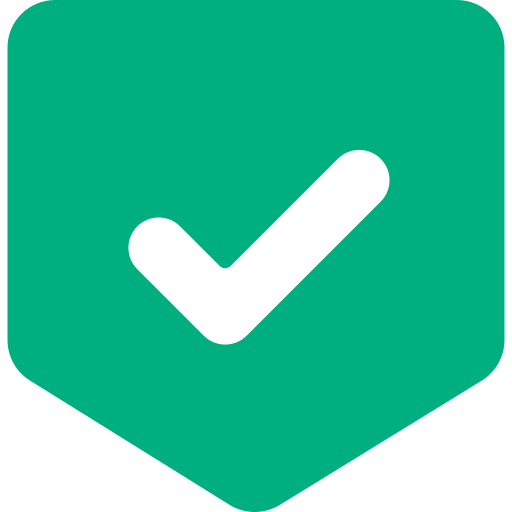

# Nova-ChartJS Plugin

This Plugin Integration requires `Nova-ChartJS 0.3.0 or higher`

## Introduction

We try to do our best to make your life a lot easier to connected with any plugin for chartjs without doing any installation of it. <br/>So, we create our [ROADMAP](PLUGIN?id=roadmap) for plugin in this nova-chartjs. 

## Roadmap

- [annotation](https://github.com/chartjs/chartjs-plugin-annotation) - Draws lines and boxes on the chart area.
- [colorschemes](https://github.com/nagix/chartjs-plugin-colorschemes) - Enables automatic coloring using predefined color schemes.
- [crosshair](https://github.com/abelheinsbroek/chartjs-plugin-crosshair) - Adds a data crosshair to line and scatter charts.
- [datalabels](#datalabels) - Displays labels on data for any type of charts. 
- [deferred](https://github.com/chartjs/chartjs-plugin-deferred) -  Defers initial chart update until chart scrolls into viewport.
- [dragdata](https://github.com/chrispahm/chartjs-plugin-dragdata) - Lets users drag data points on the chart.
- [hierarchical](https://github.com/sgratzl/chartjs-plugin-hierarchical) - Adds support for hierarchical categorical scales that can be collapsed, expanded, and focused.
- [rough](https://github.com/nagix/chartjs-plugin-rough) - Draws charts in a sketchy, hand-drawn-like style using Rough.js.
- [stacked100](https://github.com/y-takey/chartjs-plugin-stacked100) - Draws 100% stacked bar chart.
- [streaming](https://github.com/nagix/chartjs-plugin-streaming) - Adds support for live streaming data.
- [style](https://github.com/nagix/chartjs-plugin-style) - Provides styling options such as shadow, bevel, glow or overlay effects.
- [waterfall](https://github.com/everestate/chartjs-plugin-waterfall) - Enables easy use of waterfall charts.
- [zoom](https://github.com/chartjs/chartjs-plugin-zoom) - Enables zooming and panning on charts.

We use recommendation list from [awesome chartjs plugins](https://github.com/chartjs/awesome#plugins) to make prioritization for our nova-chartjs-plugin roadmap.

# Datalabels
Displays labels on data for any type of charts
<br/>Documentation: [https://github.com/chartjs/chartjs-plugin-datalabels](https://github.com/chartjs/chartjs-plugin-datalabels)

## Basic Usage

For using datalable, you just need to add `datalabels plugin` inside of `options`.
```php
->options([
    'plugins' => [
        'datalabels' => true
    ]
])
```

```php
(new StackedChart())
    ->title('Revenue')
    ->series(array([
        'barPercentage' => 0.5,
        'label' => 'Product #1',
        'backgroundColor' => '#ffcc5c',
        'data' => [30, 70, 80],
    ],[
        'barPercentage' => 0.5,
        'label' => 'Product #2',
        'backgroundColor' => '#ff6f69',
        'data' => [40, 62, 79],
    ]))
    ->options([
        'xaxis' => [
            'categories' => [ 'Jan', 'Feb', 'Mar' ]       
        ],
        'plugins' => [
            'datalabels' => true
        ]
    ])
    ->width('1/3'),
```

## Configuration

Also, you can always add configuration instead in your datalables. e.g.
```php
->options([
    'plugins' => [
        'datalabels' => [
            'color' => '#36A2EB'
        ]
    ]
])
```

For another documentation, please take a look at:
- [Options](https://chartjs-plugin-datalabels.netlify.app/guide/options.html)
- [Labels](https://chartjs-plugin-datalabels.netlify.app/guide/labels.html)
- [Positioning](https://chartjs-plugin-datalabels.netlify.app/guide/positioning.html)
- [Formatting](https://chartjs-plugin-datalabels.netlify.app/guide/formatting.html)
- [Event](https://chartjs-plugin-datalabels.netlify.app/guide/events.html)

> For access the function method, you need to create javascript function in string. <br/>Nova-chartjs will make those string into function for you.


# Suport Us

<a href="https://www.buymeacoffee.com/coroowicaksono" target="_blank"></a> Or rate us <a href="https://github.com/coroo/nova-chartjs/stargazers"></a>

# Contribute

Be one of our contributor at [contributor](https://github.com/coroo/nova-chartjs/blob/master/CONTRIBUTING.md).

# License

The MIT License (MIT). Please see [License File](https://github.com/coroo/nova-chartjs/blob/master/LICENSE) for more information.